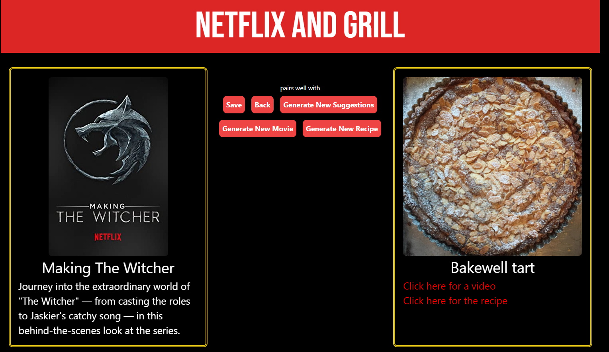

# Netflix and Grill

Ever had that problem where you want to watch a movie and you want to make some food, but you just don't know what to watch, or what to make? Us too! This app suggests meals to go along with your movie night.

## Link to Webpage 
- [Netflix and Grill](https://alexanderleino.github.io/Netflix-and-Grill/)

## How to Use This App

1. Be hungry
2. Select the requirements for the meals and movies
3. Have a delicious movie night! 

## Screenshot

## Future Features

- Include drink pairings
- Suggest food from a specific movie
- Unique Profile where user can save pairs and settings

# Docs for APIs:
- [Tasty API](https://rapidapi.com/apidojo/api/tasty/)

- [Meal Db](https://www.themealdb.com/api.php)

- [Netflix Search](https://rapidapi.com/unogs/api/unogsng/)

# Docs for CSS Frameworks:
- [Animate.css](https://animate.style/)

- [Tailwind](https://tailwindcss.com/docs)

# Possible Alternate APIs

- [Movie Db API](https://rapidapi.com/rapidapi/api/movie-database-imdb-alternative/)

- [OMDb](https://www.omdbapi.com/)

- [Streaming Availability](https://rapidapi.com/movie-of-the-night-movie-of-the-night-default/api/streaming-availability/)

- [Edamam Food Db](https://developer.edamam.com/food-database-api-docs)
